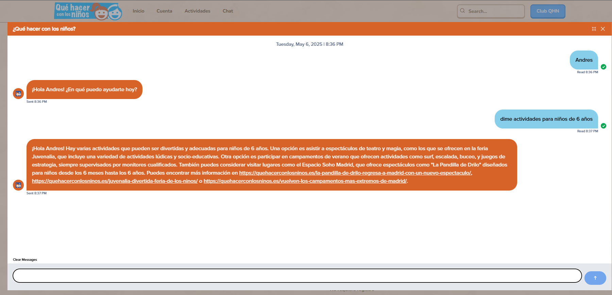

# Proyecto de Recomendación de Actividades de que hacer con los niños

Este proyecto tiene como objetivo centralizar, automatizar y mejorar el acceso a la información sobre actividades y eventos de la comunidad, así como ofrecer recomendaciones personalizadas a los usuarios.

## Descripción General

- **Extracción de Datos:**  
  Se realizó un proceso de web scraping sobre la página oficial de la comunidad para recopilar información detallada de eventos y actividades.  
- **Base de Datos:**  
  Los datos extraídos se almacenan y gestionan en una base de datos PostgreSQL, utilizando Prisma como ORM para facilitar la conexión y manipulación de los datos.
- **Chatbot Inteligente:**  
  Se implementó un chatbot basado en modelos de Hugging Face, capaz de responder preguntas sobre los días y horarios de los eventos, mejorando la experiencia de los usuarios.
- **Sistema de Recomendación:**  
  Se está desarrollando un sistema de recomendación de actividades utilizando un modelo de machine learning K-Nearest Neighbors (KNN) en Python, para sugerir eventos personalizados según los intereses de los usuarios.

## Tecnologías Utilizadas

- **Python:** Para el desarrollo del web scraping, el sistema de recomendación y la integración general.
- **Web Scraping:** Automatización de la extracción de datos desde la web de la comunidad.
- **PostgreSQL:** Almacenamiento y gestión de los datos de actividades.
- **Prisma Database:** ORM para la conexión y manipulación eficiente de la base de datos.
- **Jupyter Notebook:** Desarrollo y experimentación de modelos de machine learning de forma interactiva.
- **TensorFlow:** Implementación y experimentación de modelos de machine learning avanzados.
- **scikit-learn:** Algoritmos de machine learning, incluyendo KNN, para el sistema de recomendación.
- **Hugging Face:** Implementación del chatbot inteligente.

## Estructura del Proyecto

1. **Extracción de datos:** Scripts en Python para web scraping.
2. **Base de datos:** Esquema y conexión mediante Prisma y PostgreSQL.
3. **Chatbot:** Integración de modelos de Hugging Face para atención al usuario.
4. **Recomendador:** Implementación de KNN y otros modelos en Jupyter Notebook usando TensorFlow y scikit-learn para sugerencias personalizadas.

## Imágenes

A continuación, se pueden añadir imágenes ilustrativas del proyecto, como capturas de pantalla de la interfaz, ejemplos de respuestas del chatbot, o visualizaciones de los datos y recomendaciones.

## Colaboración

Este proyecto está abierto a la colaboración, especialmente en la creación de nuevas actividades y recursos para niños. Si tienes ideas, materiales o propuestas para actividades infantiles, no dudes en contribuir. Puedes hacerlo de las siguientes maneras:

- Proponiendo nuevas actividades para niños y familias.
- Mejorando el sistema de recomendación con nuevos algoritmos o datos.
- Añadiendo imágenes, descripciones o recursos multimedia.
- Sugerencias para mejorar la experiencia del chatbot.

Para colaborar, realiza un fork del repositorio, haz tus cambios y envía un pull request. También puedes abrir issues para sugerencias o reportar problemas.

---

Este proyecto busca facilitar el acceso a la información de la comunidad y personalizar la experiencia de los usuarios mediante inteligencia artificial y automatización de procesos, con especial atención a la oferta de actividades para niños y familias.